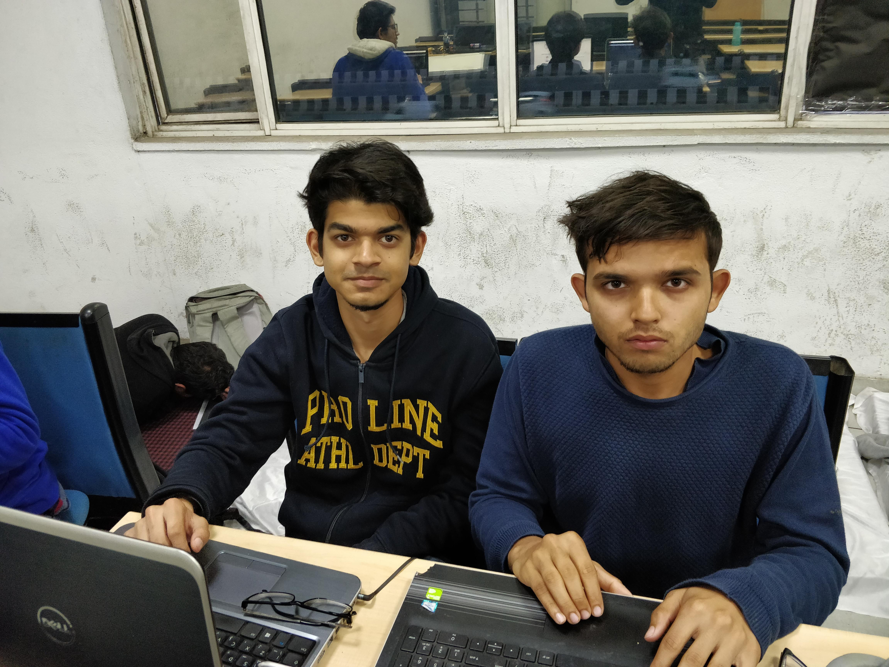
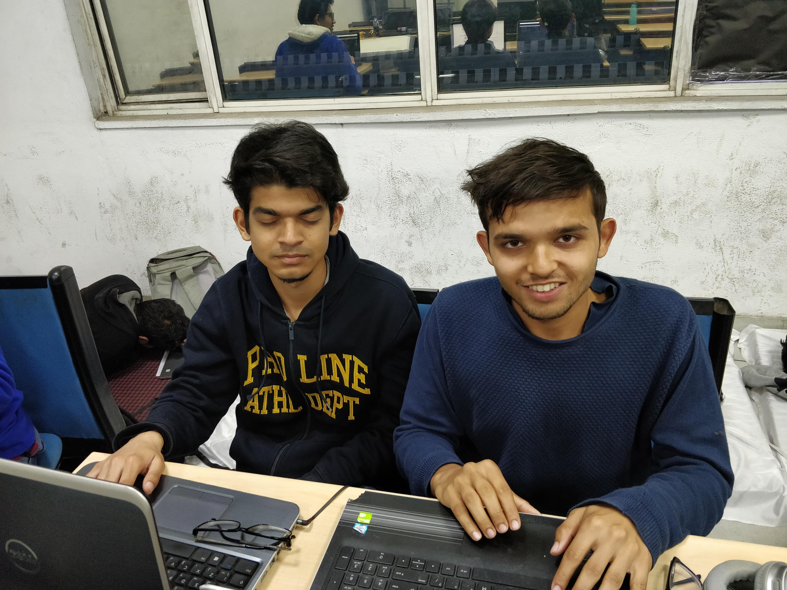
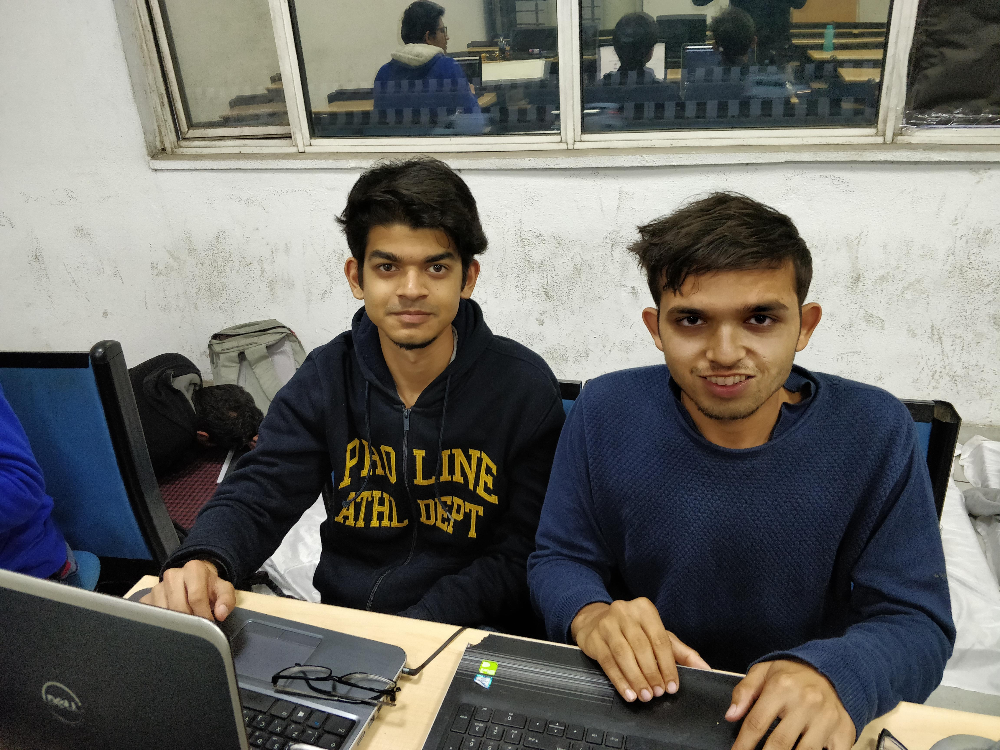
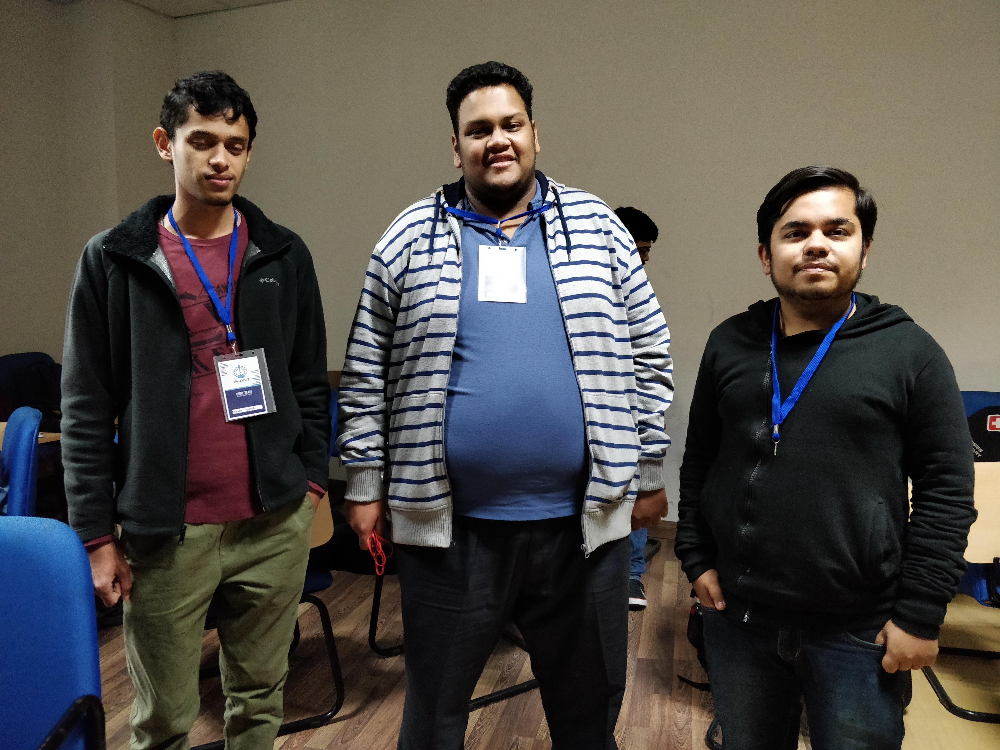
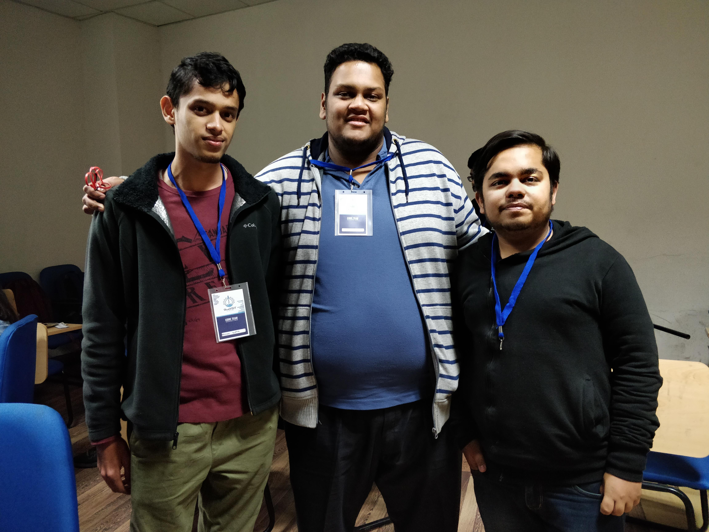
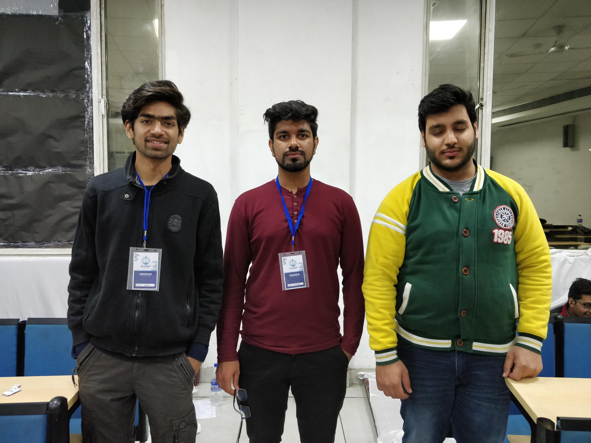
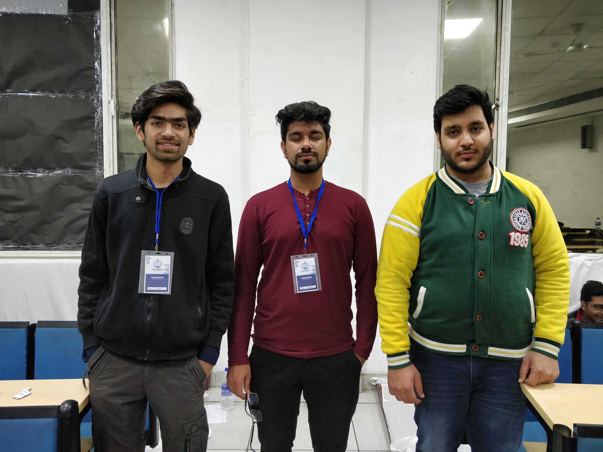
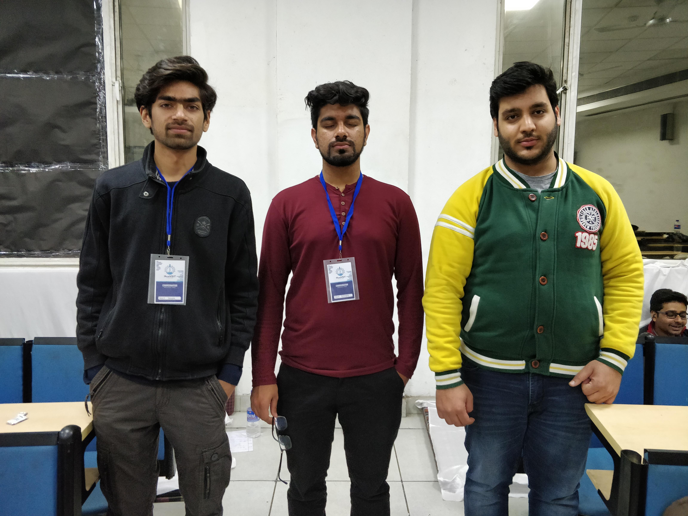
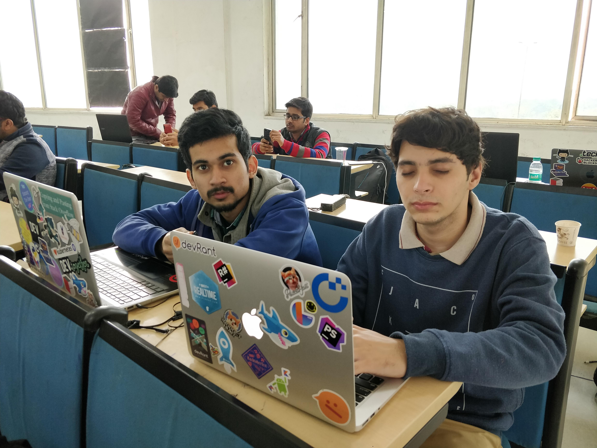
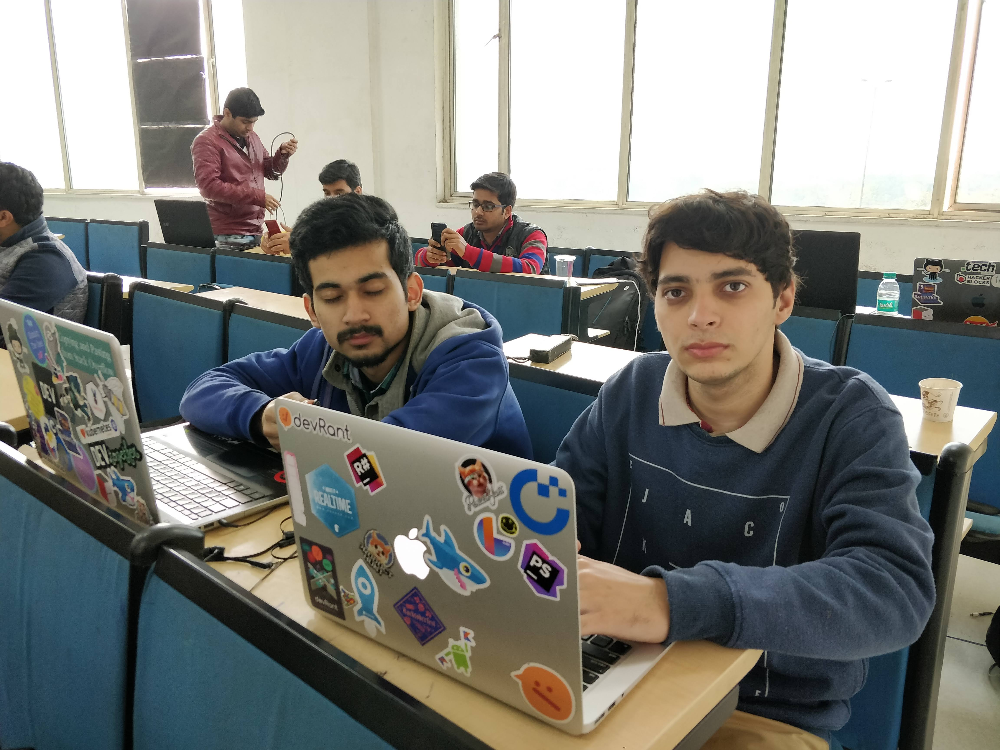

# Photogenic
### Best Photo Generation from Multiple Group Photographs

#### Find the paper @ https://ieeexplore.ieee.org/document/9036212. Feel free to cite.


## Installing Requirements
``` pip install opencv-python dlib imutils```

##
## Introduction to the Problem

* Isn’t coordinating a perfect group photograph a difficult task in its own?

* Isn’t there always someone who blinks and ruins the group photo?

* And someone who smiles in one of the multiple shots of the squad, but not in the one where eyes of most of the people are open?


## Idea Description

* Take multiple photos of the group through the application

* Upload to the server that detects the faces and facial features like their eyes (closed or open) and their mouth (smiling or frowning) using OpenCV

* Blends best photos of all members of the squad into one beautiful photograph that is most likely to have all eyes open with everyone having their best smile


## Algorithm Description

* Detect faces using DNN (since it appears to work the best among other tried algos)

* Iterate over the faces to detect eyes, ears and mouth and draw contours on eyes & mouth while determining the extent of the smile and the eyes being open

* Determine which image to keep as base, and blend faces on that image with respective better faces from other images

* Viola! We have our result image


## Assumptions

* Multiple photos are taken in succession such that people are in same sequence in the horizontal direction

* Faces of same people are detected in all photographs

* Subjects are facing towards the camera where it doesn’t matter the direction in which they are looking


<br>

# Results

### Input 1



### Intermediate Images


### Output 1


<br/><br/>

### Input 2



### Output 2


<br/><br/>

### Input 3




### Output 3


<br/><br/>

### Input 4



### Output 4

